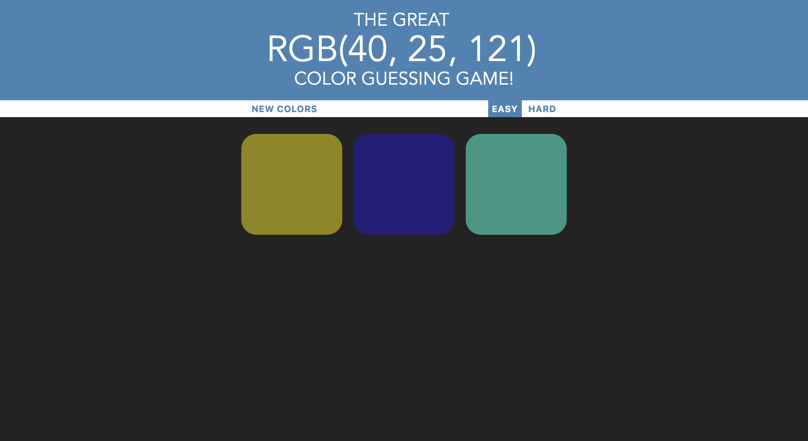
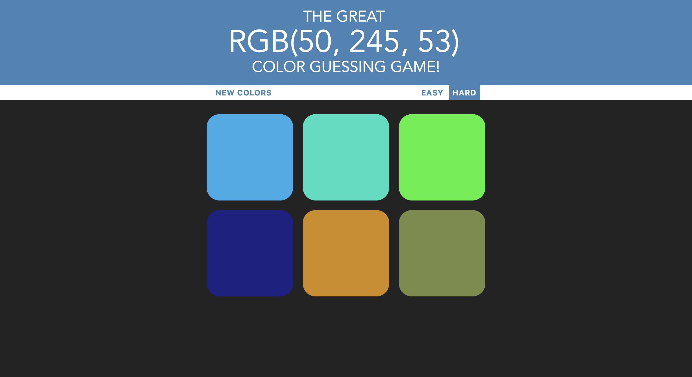

# Color-Guessing-Game

The Great RGB Color Guessing Game is game in which the player is provided with the RGB reference of a color. 
The user then has to choose the correct color from some colors displayed on the screen. The game tests the user on 
his/her ability to corelate colors to their RGB value. The **Javascript** logic for the game has been made possible
with the use of **jQuery** that helped reference specific elements(classes, id or tags) of the orirginal **HTML** document.
Other simple stylistic details of the webpage have been taken care using **CSS**.

A demonstration video of the game is shown below:

The game has two difficulty modes: **Easy and Hard modes**.
In the easy mode, the user is given 3 colors to choose from as shown in the image below.

Whereas in the hard mode, the user is provided with 6 colors to choose from as shown in the image given below. In both modes, upon pressing the NEW COLORS button, the colors are refreshed and the a new RGB value is provided for teh user to figure out.

